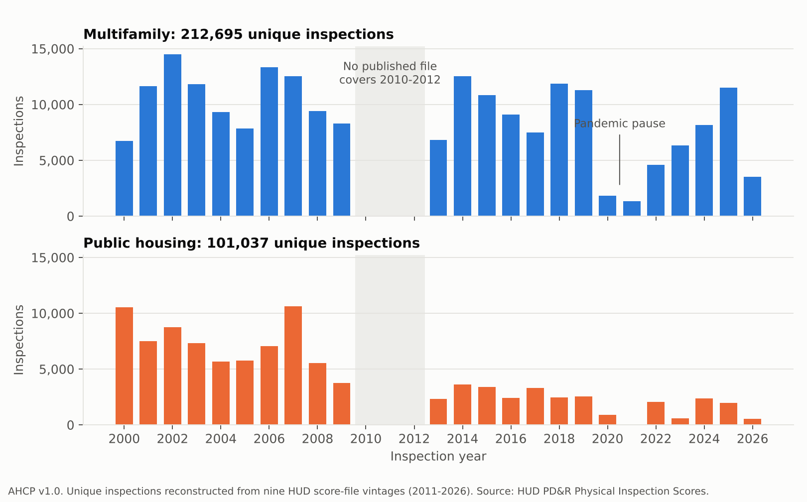

# Assisted Housing Condition Panel (AHCP)

**Status:** released, v1.0, 2026-10-06.

[](https://doi.org/10.5281/zenodo.23200318)

**DOI:** [10.5281/zenodo.23200319](https://doi.org/10.5281/zenodo.23200319) (v1.0); all versions: [10.5281/zenodo.23200318](https://doi.org/10.5281/zenodo.23200318). Repository: https://github.com/AYISHATUAMEEN/ahcp

AHCP is a property-level panel of HUD physical inspection scores for public housing and HUD-assisted or HUD-insured
multifamily housing. HUD publishes these scores as spreadsheets that list only each property's most recent inspection and
are replaced over time. AHCP stacks the 9 score-file vintages HUD still publishes
(2011, 2015, 2016, 2018, 2019, 2020, 2021, 2025, 2026), reconciles them, and rebuilds each property's inspection history on one set of
identifiers, with the inspection protocol (UPCS or NSPIRE) flagged and each property linked to its census tract, subsidy
record, tax-credit record and tract health estimates.

## What is in it

| File | Rows | Unit |
|---|---|---|
| `data/processed/ahcp_inspections.csv.gz` | 313,732 | one unique inspection (212,695 multifamily, 101,037 public housing) |
| `data/processed/ahcp_properties.csv` | 65,337 | one property, with linkages (68 columns) |
| `data/processed/ahcp_snapshots.csv.gz` | 445,664 | one source row: a property's listing in one vintage, with source file and row number |
| `data/processed/ahcp_tract_health.csv` | 27,890 | one census tract containing an AHCP property, CDC PLACES estimates |
| `data/processed/ahcp_ph_legacy_crosswalk.csv` | see file | candidate links from pre-2008 public housing project numbers to later development numbers |

Inspections run from 2000-01-11 to 2026-04-03. 58,400 properties
have more than one inspection (median 5), and 25,237 have at
least one inspection under each protocol.

Read these before using the data:

- **There is a hole from 2010 to 2012** (28 inspections in those three years). No file HUD still publishes covers it.
- **After 2013 the history is partial.** Each file from 2016 on lists one inspection per property, so an inspection that was
  superseded between two published vintages is not recoverable. The long gap between the 2021 and 2025 files is the worst case.
- **UPCS and NSPIRE scores are not on a common scale.** AHCP reports scores as published and does not rescale them.
- **Public housing identifiers change.** 14,784 public housing properties appear only under pre-2008
  project numbers and are not linked to later development numbers, except through the candidate crosswalk.

`docs/LIMITATIONS.md` has the full list. `docs/CODEBOOK.md` defines every column.



## Linkages

| Linkage | Coverage | Method |
|---|---|---|
| Census tract (2020) | 59,716 of 65,337 properties (91.4%) | point-in-polygon of HUD's coordinates on Census 2020 cartographic tracts; 5,609 properties have no coordinates |
| Subsidy record | 34,997 properties; 99.04% of multifamily and 99.71% of public housing properties in the 2026 vintage | exact join on HUD property or development ID to HUD's current eGIS layers |
| LIHTC | 6,110 properties (5,857 by address, 253 by proximity) | address and ZIP match, then same house number within 50 m; see limitations |
| Tract health (CDC PLACES 2025) | 58,803 properties (98.47% of tract-coded) | join on tract; Connecticut re-keyed to planning-region tract codes |

## Rebuild it

Python 3.10+ with `pandas`, `numpy`, `scipy`, `openpyxl`, `matplotlib`, `requests`.

```
python code/01_fetch.py          # downloads every source in code/sources.json, writes data/raw/PROVENANCE.txt
python code/02_build_panel.py    # harmonize vintages, reconstruct inspection histories
python code/03_link.py           # tract, subsidy, LIHTC, health linkages
python code/04_qa.py             # data/processed/qa_report.txt and paper/stats.json; non-zero exit on a failed check
python code/05_figures.py        # figures/  (add --final after verification)
python code/06_docs.py           # this README and docs/ from stats.json  (add --final after verification)
```

An R package in `r/ahcp` reads the released tables (`ahcp_read()`), returns one property's history (`ahcp_history()`), and
rebuilds the inspection panel from the raw HUD files (`ahcp_rebuild()`). See `r/ahcp/README.md`.

HUD replaces its workbooks in place. `data/raw/PROVENANCE.txt` records the SHA-256 of every input used for this release; a
later fetch may differ, and `04_qa.py` will show where.

## Sources

- HUD Office of Policy Development and Research, Physical Inspection Scores, 9 vintages. https://www.huduser.gov/portal/datasets/pis.html
- HUD eGIS: Multifamily Properties - Assisted; HUD Insured Multifamily Properties; Public Housing Developments; Low-Income Housing Tax Credit Properties. https://hudgis-hud.opendata.arcgis.com/
- U.S. Census Bureau, 2020 cartographic boundary file, census tracts (1:500,000).
- CDC PLACES: Census Tract Data (GIS Friendly Format), 2025 release. https://data.cdc.gov/d/yjkw-uj5s

All four are U.S. Government works. AHCP is not endorsed by HUD, the Census Bureau or CDC.

## License and citation

Data and documentation: CC BY 4.0 (`LICENSE-DATA`). Code: MIT (`LICENSE`). Cite as in `CITATION.cff`.

Maintainer: Ayishatu Ameen, Independent Researcher, Hartford, Connecticut, USA (ameenayishatu4@gmail.com).

AI assistance: code, data wrangling and documentation drafts were prepared with Claude (Anthropic). The author made the
analytic decisions and verified the outputs as recorded in `docs/VERIFY_CHECKLIST.md`.
